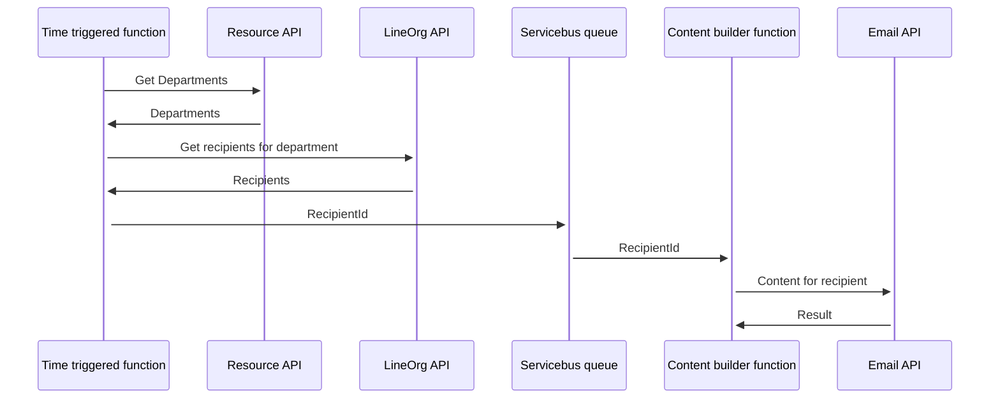

# Fusion App - Resources

The main purpose for the app is to manage personnel in the Equinor Fusion platform.

# Technical

Initial POC / MVP service design:
https://github.com/equinor/fusion/blob/technical/resource-service/services/resources.md

[Role delegation](https://github.com/equinor/fusion/blob/master/docs/technical-design/resources/role-delegation.md)

## Infrastructure

The app will manage it's own infrastructure. This includes separate Azure AD App Registration.
This makes the app transferable to other teams.

### Azure AD

> For now the fusion ad app is backing the resources api.

Test app: [GUID]
Production app: [GUID]

## Functions

### Scheduled report function

This functions send a weekly report to task- and resource-owners.

#### Flow

- The time triggered function (`ScheduledReportTimerTriggerFunction.cs`)
  run once every week (every sunday at 6 AM UTC). The time triggered unction call the Resource API to get all departments. 
  For each department all recipients from that department is collected via the LineOrg API.
- Individual recipients are sent to a queue on Azure Servicebus.
- The content builder function (`ScheduledReportContentBuilderFunction.cs`) is triggered by the queue.
  The content builder function generate email content specific to each
  recipient and their respective department. The recipient and its respective status is validated before notification
  send-out.
- The email content is sent to the Email API which send the email to the recipient.

