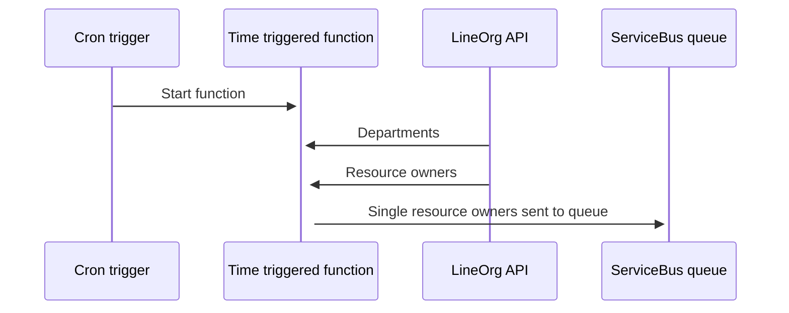
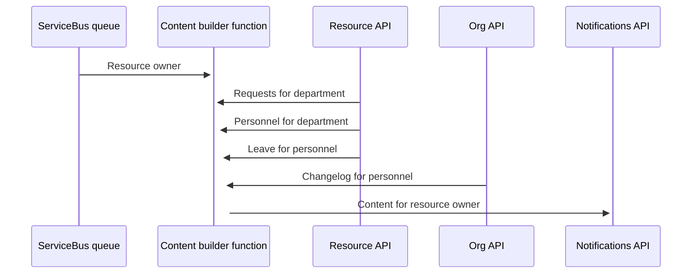

# Fusion App - Resources

The main purpose for the app is to manage personnel in the Equinor Fusion platform.

# Technical

Initial POC / MVP service design:
https://github.com/equinor/fusion/blob/technical/resource-service/services/resources.md

[Role delegation](https://github.com/equinor/fusion/blob/master/docs/technical-design/resources/role-delegation.md)

## Infrastructure

The app will manage it's own infrastructure. This includes separate Azure AD App Registration.
This makes the app transferable to other teams.

### Azure AD

> For now the fusion ad app is backing the resources api.

Test app: [GUID]
Production app: [GUID]

## Notifications

### Scheduled report
This functions send a weekly report to resource owners.
- The time triggered function
  [`ScheduledReportTimerTriggerFunction.cs`](src/backend/function/Fusion.Resources.Functions/Functions/Notifications/ResourceOwner/WeeklyReport/ScheduledReportTimerTriggerFunction.cs)
  run once every week.
- Individual resource owners are sent to a queue on Azure ServiceBus.
- The content builder function
  [`ScheduledReportContentBuilderFunction.cs`](src/backend/function/Fusion.Resources.Functions/Functions/Notifications/ResourceOwner/WeeklyReport/ScheduledReportContentBuilderFunction.cs) 
  is triggered by the queue.
  The content builder function generate an adaptive card specific to each
  resource owner and their respective department. 
- The content is sent to the Core Notifications API which send the notification to the resource owner.

#### Scheduled function

#### Builder function

